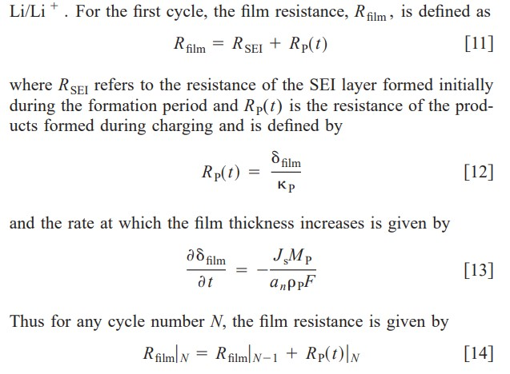

# Battery Modelling - Intro
 
This small project covers Lithium-ion battery technologies and charging methods. It is an investigation into different methods of charging Lithium ion battery cells, such that they recharge quickly, but without causing lasting damage. Investigation into mathematical modeling of the chemical reactions inside Li-ion batteries is a relatively new endeavor (past 15 years), and so are investigations of different methods to charging them.

## Motivation
My motivation for this small project came from a number of places. First, from my experience working with Li-ion batteries while at my former fuel cell company. The battery was a large and vital part of the fuel cell system. They had many modes of failure and degradation. They used a pouch cell technology in a series/parallel module configuration and experienced capacity fade very quickly. More recently, I became interested in Li-ion battery technology because of the work of a company here in Ottawa called GBatteries. They are doing fascinating work developing hardware and software charging protocols that allow Li-ion cells to charge in a matter of seconds or minutes, all without causing damage. They can accomplish this by abandoning the conventional methods to charging a battery and using their own pulsed charging method instead. 

This work is partly motivated by replicating some of the research they may be doing, or possibly have done in the past. Finally, to nurture my curiosity of the topic, I took an electrical engineering course specialization from the university of Colorado on algorithms for battery management systems (instructed by gregory l. Plett - a leader in the Li-ion research field). This 5-course specialization went deep into the math behind battery cell modeling, the electrochemistry occurring inside a cell, and computer code to co-simulate different cell constructions/chemistries. While researching the topic of fast charging Li-ion batteries, I came across [this](https://www.sciencedirect.com/science/article/pii/s2590116819300116) systematic literature review of other research into the topic. It laid a good foundation of how researchers are reconciling charging protocols with different modeling approaches. It affectionately discusses pulsed charging methods. Soon after, I came across this amazing python library, pybamm [sulzer 2020], specifically designed to provide tools for virtual experimentation of different cell chemistry models and charging protocols. So I immediately got the idea to download it and try some of my own charging protocols, to see if I could replicate/recreate the benefit of pulsed charging.

Check out pybamm [here](https://github.com/pybamm-team/pybamm)

Sulzer, v., Marquis, s. G., Timms, r., Robinson, m., & Chapman, s. J. (2020). Python battery mathematical modelling (pybamm). Ecsarxiv. February, 7.

Https://www.sciencedirect.com/science/article/pii/s2590116819300116

# Background + Literature Research
The first thing to understand is that your standard run-of-the-mill charging protocol for a consumer electronics Li-ion battery is the "cc-cv" protocol. It stands for "constant current - constant voltage". The idea is that when charging and empty battery, there are 2 phases. First, the constant-current phase, is when you apply a constant current to the battery. This increases the state-of-charge soc of the battery quickly. Good. But if you just dump current into a battery, bad can cause bad things to happen inside the battery. So once the constant-current phase of charging results in a particular terminal voltage on the battery, the charger will switch from that to applying a constant voltage to the battery (the cv step). The idea here is that now the battery charges slowly. Hence staying below the voltage, current, temperature limits set by the battery manufacturer. These limits are put in place to prevent the user from damaging the internal structure of the battery.

The cc-cv protocol for battery charging is the industry standard because it has been generally agreed upon as being a good trifecta of simplicity, safety, and speed. It is a simple charging protocol to implement in even a primitive battery management system, it is safer than simply ramming current into the battery (or other harsh protocols), and it is faster than a slow trickle charge, which would probably be the safest thing to do.  But nobody has time for that. All of this was true for lead-acid batteries, which is a different (older, and arguably more primitive) energy storage technology, and the protocol was inherited from that technology. But lots of research has been done to show that that protocol is not necessarily the best for Li-ion technologies. But regardless, it remains the industry standard.

## Side-Reactions
All batteries age. Even secondary rechargeable ones. Aging is an umbrella term that encompasses many reasons that a battery might have a shelf life. The main one of these is capacity fade. As in, with each use (or year that goes by), the battery can hold less and less energy, until it is functionally "dead" (ie, in layman's terms, "can't hold a charge"). Capacity fade is caused my many things, but mostly side-reactions. Side-reactions are another umbrella term that encompasses all the chemical reactions occurring inside the battery that do not directly result in it being charged (electrons being stored on one side) or discharged (electrons being moved from one side, across the load, to the other side). This is the focus of current research into Li-ion technologies and numerical modeling. How do we measure or estimate these side reactions so we can build batteries (or charging protocols) to slow them down?

## SEI Production
The side reaction we will focus on is called "SEI production" or "SEI thickness". SEI stands for "solid-electrolyte interphase". The way that batteries hold energy (electrons) is by Lithium ions grabbing onto them. These Lithium ions are in turn held by the active material of the electrodes (anode and cathode). The Lithium ions move from one side to the other through a chemical called the electrolyte, which is responsible for making sure that the li ions can flow back and forth to be held by the active material. But when the battery is charged, the a small amount of active material on the negative electrode (usually made of graphite) will react with the electrolyte. This reaction creates a film on the graphite structure, hence impeding its ability to hold li ions. This process is irreversible. And while some amount of SEI is expected as the cell is constructed, as it builds up, it decreases the negative electrode's capacity to hold Lithium ions (and hence electrons and charge). Hence, the goal of battery charging research is to find a strategy of charging cells that minimizes the amount of SEI buildup, in order to extend the battery's life.

# SEI Production Mathematical Modeling
## Parameter Sets - Ramadass 2004
The pybamm package comes with a some pre-loaded parameter sets. These are constants defined by the construction of the Li-ion cell being modeled. These parameter sets are defined by landmark journal papers that made advancements in battery modeling research. One such paper is [Ramadass 2004](https://scholarcommons.sc.edu/cgi/viewcontent.cgi?article=1161&context=eche_facpub), and pybamm comes with a preloaded parameter set to match this model. In this parameter set, the growth of SEI film is handled parallel to the paper in the following way...

Where:  
J_s is the current density of all side reactions occurring during charging (defined earlier in the paper as a negative quantity, making this the SEI film thickness rate of change positive)  
M_p is the molecular weight of the positive electrode (mol/kg)  
a_n is the specific surface area of the positive electrode  
Rho_p is the density of active material at the positive electrode  
and F is Faraday's constant.  

So to minimize this rate of change, the only thing we can really work with is j_s. All other quantities are either constant (or modeled to be constant on a single-cycle time scale) or slowly decreasing with age/use of the battery via this and other side reactions. There's nothing we can do about those. To minimize j_s, we have to minimize the side reactions. Which, because we know they are happening all the time no matter what, means we have to limit as much as possible the amount of current applied to the battery during charging. This should be a hint as to why pulsed charging may be better, as in this protocol, the cell spends much of its time with no current applied, and hence having no additional SEI built up. But more on this later.

## Other Parameter Sets
In addition to the Ramadass model, we can define other parameter sets to see how different charging protocols will work on cell constructions with those parameters. Future work on this project will focus on applying charging protocols to different parameter sets

# Implementation Approach
The baseline will be the industry standard "cc-cv" protocol. With the charging current and voltage being appropriate to the model being used and discussed in the implementation notebook. We will simulate the cell being charged using an aggressive load profile and then recharged using cc-cv, 4x times. When the simulation is complete we will plot a number of signals including current, voltage, discharge capacity, SEI thickness, and Lithium loss. The latter two being our primary indicators of irreversible aging processes. The "results" of these experiments (ie, the quantity determining ranking of protocols) will be charge time (time, hours, from empty to full soc), charge speed (avg ah deposited per hour), SEI production, and SEI production per unit charge speed. Hence, the "best" protocol in our case, will be the protocol that minimizes SEI production while maximizing charge speed. We will experiment with a few different pulsed protocols and compare them to the baseline cc-cv and to each other. 

Continue on to discussion of implementation and code [here](cycle_aging.ipynb)

